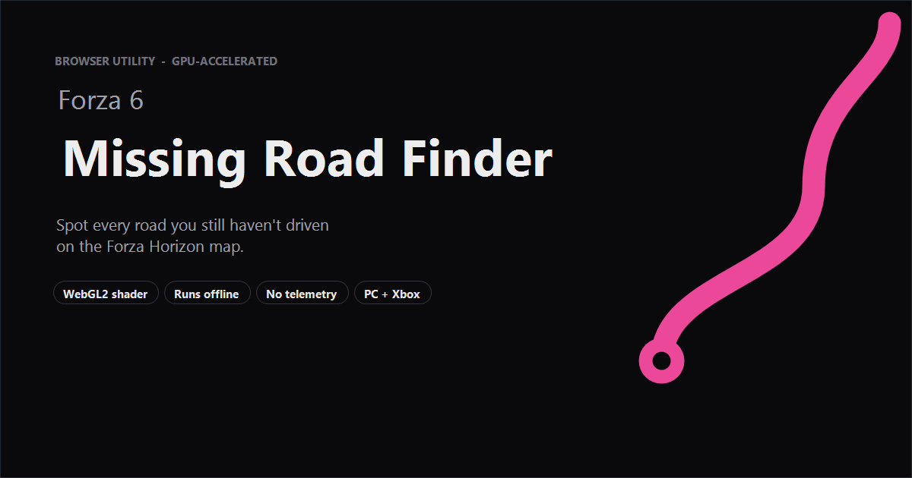

<div align="center">
  
</div>

#  Forza 6 Missing Road Finder

**Live tool → [harkis123.github.io/Forza-6-Missing-Road-Finder](https://harkis123.github.io/Forza-6-Missing-Road-Finder/)**

Find the roads you still haven't driven on the Forza Horizon map — without squinting at a screen full of green and white.

The tool repaints undiscovered roads in a colour you can actually see, then desaturates everything else. It runs entirely in your browser and works either by live-capturing your game window (on PC) or by accepting a screenshot (from Xbox or PlayStation).

## Two ways in

### PC — live capture

Open the page, switch to the **PC · Live** tab, and click **Share Screen**. Pick your Forza window from the browser dialog. Every time you open the in-game map, the unexplored roads light up in lime green in real time. Press *Pause* if you want to freeze the current frame and study it.

### Xbox — screenshot upload

Open the map in-game, press **Xbox + Y** to capture, then wait a few seconds for the screenshot to sync to the Xbox companion app on your phone (or to xbox.com). Switch the tool to the **Xbox** tab, then either:

- tap **Upload screenshot** and pick the file,
- drag the image into the drop zone, or
- press <kbd>Ctrl</kbd>+<kbd>V</kbd> to paste it.

The processed map appears in the canvas instantly.

### PlayStation — screenshot upload

Open the map in-game. On **PS5** tap the **Create** button → *Take Screenshot*; on **PS4** press or hold **Share** → *Save Screenshot*. Sync the capture to the **PlayStation App** on your phone, or pull it off the console over USB from *Settings → Captures and Broadcasts*. Switch the tool to the **PS** tab and upload the file exactly the same way as the Xbox flow above.

> Console screenshots usually keep the undiscovered grey close enough to `#808080` that the default Tolerance of 1 catches them cleanly. Bump it up one notch at a time if you spot roads slipping through.

## Settings cheat sheet

| Where | What |
| --- | --- |
| **Find / Replace** colour pickers | The colour to look for and the colour to swap it for. Defaults are tuned to Forza's undiscovered-road grey and a high-contrast lime green. |
| **Tolerance** | A perceptual margin around the *Find* colour — how far a pixel can drift and still count as a match. |
| **Desaturate background** | When on, every pixel that *didn't* match is dimmed to grey, so the highlight has nothing to compete with visually. |
| **FPS** | How often the live capture loop processes a new frame (PC only). |
| **Native scale / Fit to window** | Toggles between a 1:1 view (scrollable) and a stretched-to-fit view. |
| **Save image** | Downloads the processed canvas as a timestamped PNG. |

## Running it locally

The entire app is a handful of static files — no build step. From a clone of this repo, point any static file server at the root:

```
npx -y serve .
```

Then open the URL it prints. Python's `python -m http.server`, VS Code's Live Server, etc. all work the same way.

## How the colour swap actually works

Once a frame lands on the canvas — whether from a video element (PC mode) or from `createImageBitmap` of a JPEG (Xbox mode) — it is uploaded to the GPU as a texture. A WebGL2 fragment shader then processes every pixel in parallel:

1. Convert the sample and the *Find* colour to (approximate) linear sRGB.
2. Compute a luma-weighted Euclidean distance between them.
3. If the distance is below the *Tolerance* threshold, emit the *Replace* colour.
4. Otherwise, either pass the pixel through unchanged, or emit its luma value if *Desaturate background* is on.

The whole pass is a single draw call and finishes in roughly 1–3 ms even on integrated graphics, which is why this approach can keep up with 4K screenshots and a 30 fps live stream without ever touching the CPU pixel buffer.

## Privacy

There is no backend. Every byte of every frame is processed inside the page you have open. Nothing — no screenshot, no setting, no telemetry — is ever sent anywhere. A small service worker caches the page on first load, so after that the tool works offline indefinitely.

## Browser support

You need a browser with WebGL2 and the modern clipboard / file APIs — in practice any recent version of Chrome, Edge, Firefox, or Safari (15+). On phones, both Android Chrome and iOS Safari work. Live screen capture (PC mode) additionally requires `getDisplayMedia`, which is desktop-only on most browsers.

## License

Personal project; no warranty, no support guarantees. Feel free to fork.
